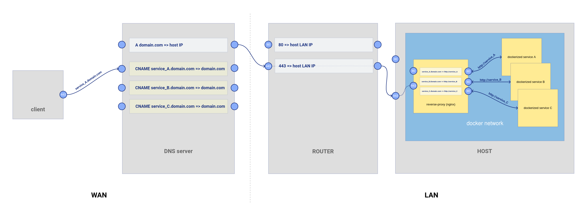

docker HTTPS nginx reverse-proxy setup

# overview



The nginx reverse proxy docker manage HTTPS and redirect requests to correct docker containers based on hostname. It uses [lets-encrypt docker image](https://github.com/linuxserver/docker-letsencrypt)

## repository structure

- reverse-proxy-setup => setup.sh *run it on your server*
- reverse-proxy-vm => Dockerfile *used only to test setup*
- reverse-proxy-vm-tester => tests/Dockerfile *used only for docker hub automated tests*

# quickstart

## network setup

- make sure that every desired subdomain has DNS records points to its WAN IP (CNAME + A).
- make sure the host running the let's encrypt docker is reachable from WAN on ports 80 & 443 (ex: redirect ports on router)

## dependencies

- [docker](https://github.com/docker/docker-ce). for ubuntu : `curl -s https://raw.githubusercontent.com/monkeydri/ubuntu-server-scripts/master/docker-setup.sh | bash`
- [docker-compose](https://github.com/docker/compose). for ubuntu : `curl -s https://raw.githubusercontent.com/monkeydri/ubuntu-server-scripts/master/docker-compose-setup.sh | bash`

## run

- create .env file (see [.env](.env) file as example)
	required env vars 
	- EMAIL: admin email (ex : `URL=admin@domain.com`)
	- URL : domain name (ex : `URL=domain.com`)
	- SUBDOMAINS : comma-separted list of subdomains (ex : `SUBDOMAINS=www,ftp`)
	source it `source .env`
- run setup script `curl -s https://raw.githubusercontent.com/monkeydri/docker-https-nginx-reverse-proxy/master/setup.sh | bash`

## add a new service (docker container running behind the reverse-proxy)

base setup : docker-compose.yml for each service are placed in respective directories inside a dir named `dockers`

- dockers/
	- reverse-proxy/
		- [docker-compose.yml](docker-compose.yml)
		- config <= folder containing required configuration files and generated SSL certificates
		- nginx.conf <= shortcut to lets-encrypt internal conf file
	- service-A/
		- docker-compose.yml
		- conf-files...
	- service-B/
		- docker-compose.yml
	- ...

- put the docker-compose.yml file in dockers/new-docker/

```yml
version: '2'

services:
  new-service:
    image: some/docker:1.2.3
    restart: unless-stopped
    volumes:
    - ${PWD}/conf-file.conf:/path/to/conf-file.conf
    networks:
    - letsencrypt_nginx-net
networks:
  letsencrypt_nginx-net:
    external: true
```


- add a block at the end of the lets-encrypt docker nginx conf file `nginx.conf`

template block :

```conf
{
	# new-service
	server
	{
		listen 443 ssl;

		root /config/www;
		index index.html index.htm index.php;

		server_name subdomain.domain.com;

		# all ssl related config moved to ssl.conf
		include /config/nginx/ssl.conf;

		client_max_body_size 0;

		location / {
			proxy_pass							http://new-service;

			proxy_read_timeout      300;
			proxy_connect_timeout   300;
			proxy_redirect          off;

			proxy_set_header        X-Forwarded-Proto $scheme;
			proxy_set_header        Host              $http_host;
			proxy_set_header        X-Real-IP         $remote_addr;
			proxy_set_header        X-Forwarded-For   $proxy_add_x_forwarded_for;
			proxy_set_header        X-Forwarded-Proto https;
			proxy_set_header        X-Frame-Options   SAMEORIGIN;
			# proxy_set_header X-Forwarded-Ssl on; # uncomment if 422 HTTP Error on POST request

			access_log /var/log/nginx/access.log;
			error_log /var/log/nginx/error.log;
		}
	}
}
```

replace the lines `server_name subdomain.domain.com;` and `proxy_pass http://new-service;` where new-service corresponds to the name of the service in docker-compose.yml.

- start the new-service docker container `cd ./new-service && docker-compose up -d`

- restart lets'encrypt docker nginx service : `cd ./lets-encrypt && docker-compose exec -it lets-encrypt s6-svc -h /var/run/s6/services/nginx`

# ready to deploy services

- [gitlab-server](https://github.com/monkeydri/gitlab-server)
- [seafile-server](https://github.com/monkeydri/seafile-server)

# tests [](https://hub.docker.com/r/monkeydri/reverse-proxy)

A [docker container](https://hub.docker.com/r/monkeydri/reverse-proxy) is provided to test this setup (on ubuntu 18.04). It includes a test setup + additional tools to respond to tests. It is not meant to be run on your host, it is meant to run on docker hub to receive tests.

## toolchain

Using a docker container and docker hub automated build with autotests is a cheap and simple alternative to running a full VM (ex with circle-CI) to test the setup.

The [reverse-proxy](https://hub.docker.com/r/monkeydri/reverse-proxy) docker image is build on docker hub on each push and afterwards tests are run on it via another sut container : [docker-compose.tests.yml](docker-compose.tests.yml).

## build

To build it manually set required values in env file (see [.test.env](.test.env) file as example)

then `docker build . -t monkeydri/reverse-proxy`.

Then run it with required env vars : `docker run --rm --env-file=.env -it monkeydri/reverse-proxy bash`. To override entrypoint : `docker run --rm --env-file=.env --entrypoint="/bin/sh" -it monkeydri/reverse-proxy -c /home/user/dockers/reverse-proxy/setup.sh`.

## connect the docker container to the world

[serveo](https://serveo.net/) is used to proxy let's encrypt bot requests to the test container.

*Note : must use self-hosted serveo as ports 80 and 443 are most likely already used by someone else*.

Setup to allow serveo to establish tunnel to the test subdomain.

- generate SSH key pair
- add an A record subdomain.domain.com => 159.89.214.31 (serveo.net)
- add a TXT record authkeyfp=[fingerprint] where fingerprint is the SSH key fingerprint (ssh-keygen -l)

*Note : those steps are required by [serveo manual](https://serveo.net/#manual) to allow custom subdomain but are optional in practice (serveo allows everything)*.


## setup [build env vars in docker hub](https://docs.docker.com/docker-hub/builds/#environment-variables-for-builds)

- EMAIL=admin@domain.com
- URL=domain.com
- SUBDOMAINS=subdomain
- TEST_MODE=true
- SSH_PUBLIC_KEY=
- SSH_PRIVATE_KEY=
- TIMBER_API_KEY & TIMBER_SOURCE_ID : for remote logging with [Timber](timber.io)

where `SSH_PUBLIC_KEY` is output of `cat ~/.ssh/id_rsa_serveo.pub` and `SSH_PRIVATE_KEY` is escaped output of `cat ~/.ssh/id_rsa_serveo` => `printf "%q\n" "$(cat ~/.ssh/id_rsa_serveo)"` (it needs to be esacped because it is multiline).

*(id_rsa_serveo being the path to the previsouly generated SSH key pair).*

Those env vars are passed to the [reverse-proxy](https://hub.docker.com/r/monkeydri/reverse-proxy) container so it can connect to serveo on a custom domain.

## tests actually run (see [tests.sh](tests/tests.sh))

- [x] docker reachability on WAN (on test port 7357)
- [ ] SSL certificates generation
- [ ] service reachability behind the reverse-proxy
- [ ] email reception

# sources

- https://blog.linuxserver.io/2017/11/28/how-to-setup-a-reverse-proxy-with-letsencrypt-ssl-for-all-your-docker-apps/
- https://github.com/linuxserver/docker-letsencrypt/issues/71
- https://www.digitalocean.com/community/tutorials/how-to-use-netcat-to-establish-and-test-tcp-and-udp-connections-on-a-vps + https://serverfault.com/questions/346481/echo-server-with-netcat-or-socat